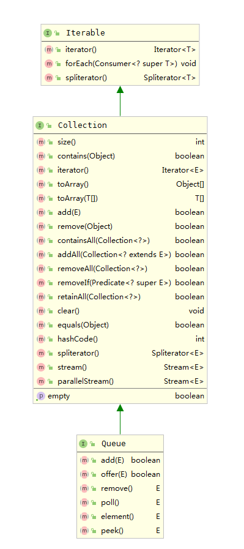
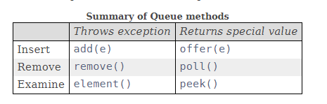
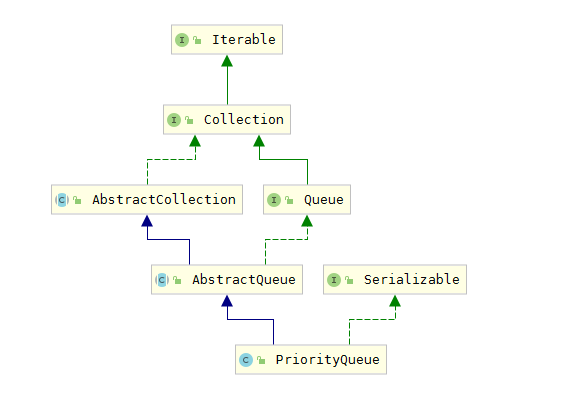

# 学习笔记

## 作业

- ### 用 add first 或 add last 这套新的 API 改写 Deque 的代码

#### 原代码
```java
Deque<String> Deque = new LinkedList<String>();
deque.push("a");
deque.push("b");
deque.push("c");
System.out.println(deque);

String str = deque.peek();
System.out.println(str);
System.out.print(deque);

while (deque.size() > 0) { 
  System.out.println(deque.pop()); 
}
System.out.println(deque);
```

#### 使用新API修改后
```java
Deque<String> Deque = new LinkedList<String>();
deque.addFirst("a");
deque.addFirst("b");
deque.addFirst("c");
System.out.println(deque);

String str = deque.peekFirst();
System.out.println(str);
System.out.print(deque);

while (deque.size() > 0) { 
  System.out.println(deque.removeFirst()); 
}
System.out.println(deque);
```

- ### 分析 Queue 和 Priority Queue 的源码


从图中可以看到， Java的Queue是一个接口，支持以下这些操作



其实现类主要有PriorityQueue， 继承的接口是Deque，接口Deque接口的实现类是ArrayDeque，同时Deque还被LinkedList类实现

#### PriorityQueue



PriorityQueue实现了Queue接口，同时按照队列元素的大小进行重新排序。因此当调用peek()或者是poll()的方法取出队列中的元素通常都是最小或最大的元素。

优先队列的实现其实底层使用的是堆，初始化时将集合对象进行堆化，使用了siftdown()函数；而调用poll()时会将堆顶元素返回，并再次执行siftdown()操作


## 已学内容思维导图

https://www.edrawsoft.cn/viewer/public/s/db378243466063

后续会不断补充更新
